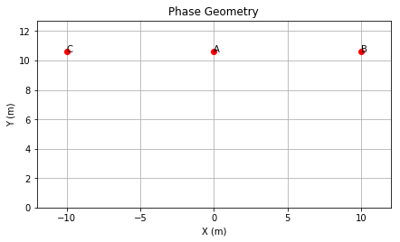
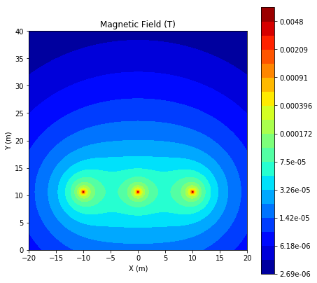
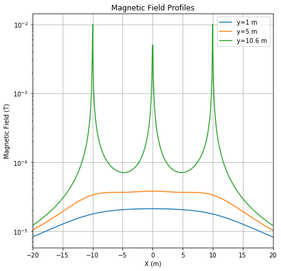
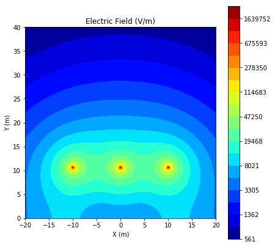
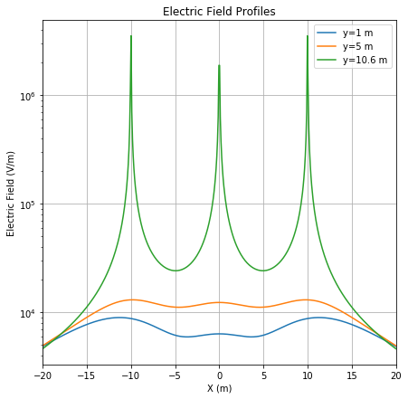
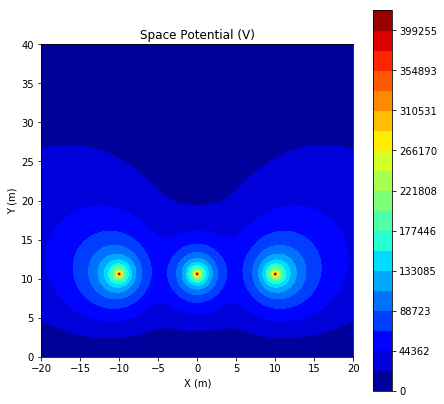
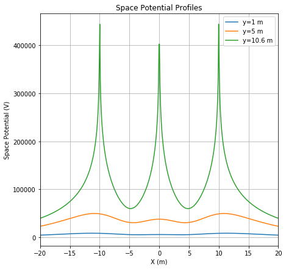

# EMF Calculator

[](https://travis-ci.com/mpewsey/emf)
[](https://emf.readthedocs.io/en/latest/?badge=latest)
[](https://codecov.io/gh/mpewsey/emf)

## About

This package provides tools for performing electromagnetic field (EMF) analysis
for transmission lines.

## Installation

The development version of this repository may be installed via pip:

```
pip install git+https://github.com/mpewsey/emf#egg=emf
```

## Example

To perform an analysis, simply create a list of phases or phase segments and
pass them to the desired analysis constructor:

```python
from emf import Phase2D, EMFAnalysis2D

phases = [
    Phase2D('A', -10, 10.6, 0.033, 525000, 1000, 120, 3, 0.45),
    Phase2D('B', 0, 10.6, 0.033, 525000, 1000, 0, 3, 0.45),
    Phase2D('C', 10, 10.6, 0.033, 525000, 1000, -120, 3, 0.45)
]

emf = EMFAnalysis2D(phases)
```

Methods can be called on the analysis object to acquire the desired field
values or to generate plots of cross sections. For example, the below plots
were generated from the above phase configuration.

<table>
    <tr>
        <td></td>
        <td></td>
    </tr>
	<tr>
	    <td></td>
	    <td></td>
	</tr>
	<tr>
	    <td></td>
	    <td></td>
	</tr>
	<tr>
	    <td></td>
	    <td></td>
	</tr>
</table>
